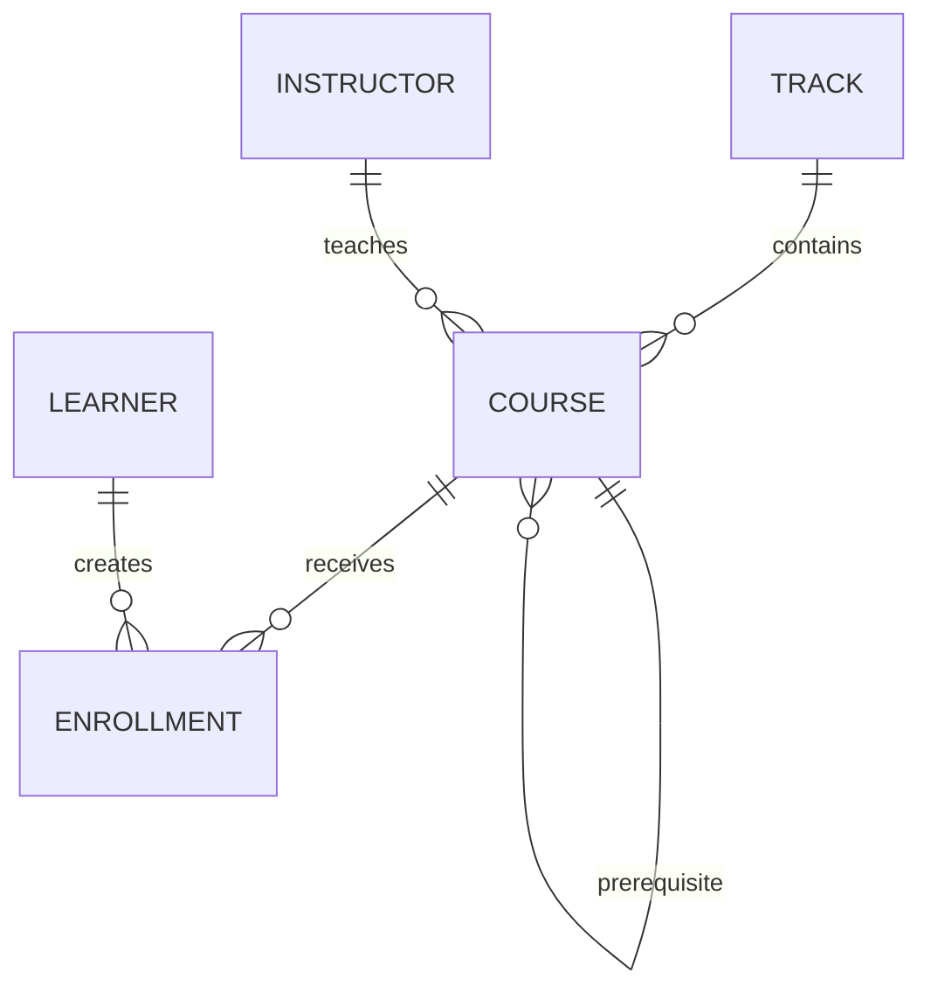

# TSQ Examples

`examples/` 不再是零散功能拼盘，而是一个完整的 SQLite 业务域：**Academy** 培训平台。
同一套表和 seed data 覆盖三层示例，重点是让你看清楚：

1. **这个查询在业务上是在干什么**
2. **它具体演示了 TSQ 的哪一类能力**
3. **复杂能力是怎么从简单写法一步步长出来的**

## 学习顺序

| 目录 | 业务场景 | 重点能力 |
| --- | --- | --- |
| [`academy/`](academy/) | 共享 Academy 模型、seed 数据和场景实现 | `@TABLE`、`@RESULT`、生成代码、可复用 query logic |
| [`quickstart/`](quickstart/) | 课程目录的最小日常操作 | CRUD helper、关键词搜索、基础查询构建链路 |
| [`advanced/`](advanced/) | 把目录和报名数据做成分析型查询 | alias、聚合、`InVar`、subquery、`CASE`、CTE、set ops、chunked |
| [`full-suite/`](full-suite/) | 给学习后台做一个学习旅程看板 | joins、子查询、`@RESULT`、分页 |

## Academy ER 图



## 各表关系说明

- `track` 与 `course` 是一对多：`course.track_id -> track.id`，一条学习路径下可以挂多门课程。
- `instructor` 与 `course` 是一对多：`course.instructor_id -> instructor.id`，一位讲师可以负责多门课程。
- `course` 存在自关联：`course.prerequisite_id -> course.id`，表示当前课程的前置课；示例数据里 `0` 表示“没有前置课”。
- `learner` 与 `enrollment` 是一对多：`enrollment.learner_id -> learner.id`，一个学员可以报名多门课程。
- `course` 与 `enrollment` 是一对多：`enrollment.course_id -> course.id`，一门课程可以有多条报名记录。
- `enrollment` 是学员和课程之间的关联表，同时承载报名状态、得分、实付金额，以及 `version` / `deleted_at` 这类生命周期字段。

## 代码怎么读

推荐按这个顺序看：

1. `academy/*.go`：看领域模型，理解表长什么样
2. `academy/scenarios.go`：看每个 demo 的业务意图和 TSQ 写法
3. `quickstart/main.go` / `advanced/main.go` / `full-suite/main.go`：看如何把单个场景跑起来
4. 对应 README：看每个 demo 在讲什么

## 示例能力地图

| Demo | 业务问题 | TSQ 能力 |
| --- | --- | --- |
| `runTrackCRUDDemo` | 课程路径的增删改查 | 生成的 `Insert / Update / Delete` helper |
| `runCatalogSearchDemo` | 按关键词搜课程目录 | 关键词搜索、分页、`Page...` helper |
| `runBackendCatalogDemo` | 查某条学习路径下的已发布课程 | `Select` / `From` / `Join` / `Where` / `List` |
| `runAliasDemo` | 查课程及其前置课标题 | alias / rebinding |
| `runAggregateDemo` | 按路径汇总报名人数与平均得分 | aggregate、`GroupBy`、`Having` |
| `runInVarDemo` | 用一组动态课程 ID 过滤目录 | `InVar()` |
| `runSubqueryDemo` | 用子查询筛学员和课程 | `In(subquery)`、标量子查询 |
| `runCaseDemo` | 给学员报名打运营标签 | `CASE WHEN` |
| `runCTEDemo` | 先抽平台课程子集再继续查询 | non-recursive CTE |
| `runSetOpsDemo` | 合并/排除课程集合 | `UNION`、`EXCEPT` |
| `runChunkedDemo` | 在一个事务里批量处理报名记录 | `runtime.WithTx(...)`、`ChunkedInsert`、`ChunkedUpdate`、`ChunkedDelete` |
| `runOptimisticLockDemo` | 先制造过期快照，再自动重试更新同一条报名记录 | `tsq.WithTx1(...)`、`IsOptimisticLockError`、自动乐观锁重试 |
| `runComprehensive` | 生成学习旅程看板 | joins、子查询、`@RESULT`、`query.Page(...)` |

## 运行方式

```bash
make examples
./bin/examples/quickstart
./bin/examples/advanced
./bin/examples/full-suite
go test ./examples/...
```

## 生成文件说明

以下文件由 `tsq gen` 基于 `academy/*.go` 生成，不要手改：

- `academy/*_tsq.go`
- `academy/*_result_tsq.go`
- `academy/sqlite.sql`
- `academy/mysql.sql`
- `academy/postgres.sql`
- `academy/tsq.json`

修改 `academy/*.go` 后，重新生成：

```bash
tsq gen ./examples/academy
```

当前生成代码中的查询 helper 不会因为包初始化失败直接 `panic`；  
如果模型、注解和生成结果不一致，错误会在调用对应 helper 时返回出来，因此重新生成后最好直接跑一遍示例或测试。

## 锁相关说明

这套示例运行时统一使用 **SQLite**，所以：

- **自动乐观锁** 是可运行、可观察的，`runOptimisticLockDemo` 会演示“第一次因过期版本失败、随后自动重试成功”的完整流程
- **行锁 DSL**（`ForUpdate()` / `ForShare()` / `NoWait()` / `SkipLocked()`）不会在示例里执行，因为 SQLite 不支持这些语句

如果你想演示行锁，请把同样的 query 放到 MySQL 或 PostgreSQL runtime 中执行，并放在显式事务里观察锁行为。
